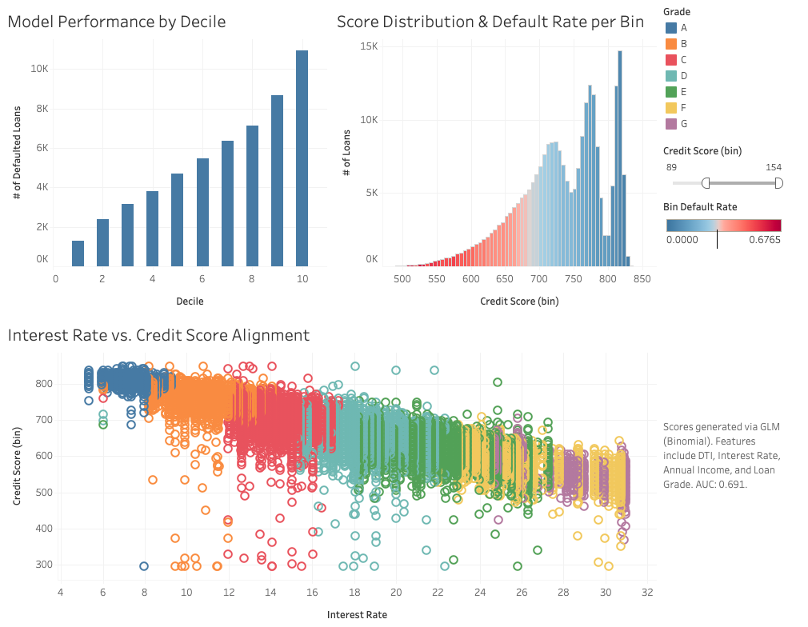

# Credit Risk Scorecard

End-to-end credit risk scorecard project built with R and Tableau. The project cleans Lending Club loan data, explores key risk patterns, builds a logistic regression model to estimate default probability, converts predictions into credit scores, and exports a Tableau-ready dataset for dashboarding.

## Dashboard

View the interactive Tableau dashboard here:

[Credit Risk Analysis Dashboard](https://public.tableau.com/views/CreditRiskAnalysis_17784825861220/Dashboard1?:language=en-US&:sid=&:redirect=auth&:display_count=n&:origin=viz_share_link)

### Dashboard Screenshot



## Project Overview

This project creates a credit risk scorecard workflow using historical loan data. The final model predicts whether a loan is likely to become bad, then translates the predicted default probability into a simplified credit score.

The workflow includes:

- **Data cleaning**: Filters loan statuses, creates a binary default target, trims text fields, converts employment length and term fields, imputes missing employment length, and selects model-ready variables.
- **Exploratory data analysis**: Reviews default rates by grade, purpose, and state, compares interest rate and debt-to-income distributions, and summarizes borrower risk patterns.
- **Modeling**: Builds logistic regression models using borrower, loan, and credit history variables.
- **Evaluation**: Reviews predictions with a confusion matrix, ROC curve, AUC, variable importance, and decile analysis.
- **Scorecard output**: Converts default probabilities into credit scores and exports a Tableau-ready CSV.
- **Dashboarding**: Uses Tableau to visualize credit risk patterns and model outputs.

## Repository Structure

```text
credit-risk-scorecard/
├── data/
│   ├── raw/
│   │   └── loan.csv
│   ├── processed/
│   │   └── loan_data_clean.rds
│   ├── LCDataDictionary.xlsx
│   └── tableau_export.csv
├── scripts/
│   ├── 01_cleaning.R
│   ├── 02_eda.R
│   └── 03_modeling.R
├── tableau_dashboard.txt
├── credit-risk-scorecard.Rproj
├── LICENSE
└── README.md
```

## Data

The project uses Lending Club loan data from Kaggle:

[Lending Club Loan Data CSV](https://www.kaggle.com/datasets/adarshsng/lending-club-loan-data-csv)

The raw dataset is stored locally in `data/raw/loan.csv`.

Key generated files:

- **`data/processed/loan_data_clean.rds`**: Cleaned modeling dataset created by `scripts/01_cleaning.R`.
- **`data/tableau_export.csv`**: Tableau-ready export created by `scripts/03_modeling.R`.
- **`data/LCDataDictionary.xlsx`**: Data dictionary for the Lending Club dataset.

## Scripts

### `scripts/01_cleaning.R`

Loads the raw loan data and prepares it for analysis and modeling.

Main steps:

- Keeps resolved loan statuses such as fully paid, charged off, default, and late loans.
- Creates `is_bad`, where `1` represents a bad loan and `0` represents a good loan.
- Converts employment length into `emp_length_num`.
- Extracts loan term into `term_months`.
- Imputes missing employment length values with the median.
- Selects loan, borrower, credit history, and financial health variables.
- Saves the cleaned dataset to `data/processed/loan_data_clean.rds`.

### `scripts/02_eda.R`

Performs exploratory analysis on the cleaned loan dataset.

Analysis includes:

- Default rate by loan grade.
- Interest rate distribution by loan outcome.
- Debt-to-income distribution by loan outcome.
- Default rate by loan purpose.
- Average interest rate, annual income, and DTI by loan outcome.
- Interest rate spread between good and bad loans.
- State-level risk ranking.

### `scripts/03_modeling.R`

Builds and evaluates logistic regression models for credit risk.

Modeling steps include:

- Splitting the cleaned data into training and testing sets.
- Building a baseline logistic regression model.
- Building an expanded logistic regression model using loan, borrower, and credit variables.
- Generating predicted default probabilities.
- Evaluating model performance with a confusion matrix, ROC curve, and AUC.
- Reviewing variable importance using coefficient z-scores.
- Performing decile analysis.
- Creating a credit score with the formula:

```text
credit_score = 850 - (prob_default * 550)
```

- Exporting Tableau fields to `data/tableau_export.csv`.

## Model Features

The expanded model uses:

- **Interest rate**: `int_rate`
- **Debt-to-income ratio**: `dti`
- **Annual income**: `annual_inc`
- **Loan grade**: `grade`
- **Recent account openings**: `acc_open_past_24mths`
- **Revolving utilization**: `revol_util`
- **Total accounts**: `total_acc`

## Tableau Export

The exported Tableau dataset includes:

- `is_bad`
- `prob_default`
- `credit_score`
- `int_rate`
- `dti`
- `annual_inc`
- `grade`
- `decile`

This file is designed for dashboard visualizations such as risk score distribution, default probability by grade, decile performance, and borrower risk profiles.

## Requirements

This project is written in R and uses the following packages:

- `tidyverse`
- `lubridate`
- `janitor`
- `tidymodels`
- `scales`

## How to Run

Open `credit-risk-scorecard.Rproj` in RStudio, then run the scripts in order:

```r
source("scripts/01_cleaning.R")
source("scripts/02_eda.R")
source("scripts/03_modeling.R")
```

After running the modeling script, use `data/tableau_export.csv` as the data source for Tableau.

## License

This project is licensed under the terms included in the `LICENSE` file.
